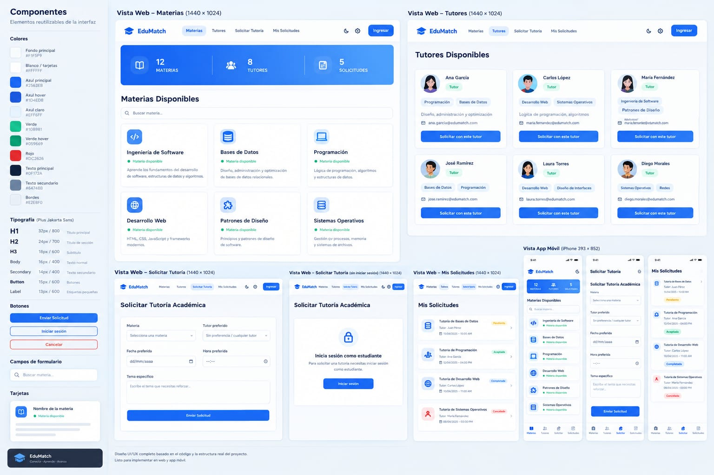
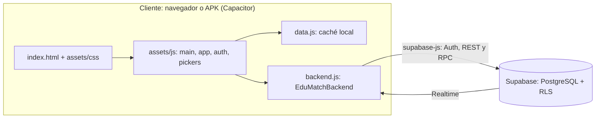

# EduMatch — Conecta, aprende y avanza

MVP para organizar tutorías académicas universitarias: el estudiante se registra,
inicia sesión, busca una materia, elige un tutor (o deja que la app lo asigne) y
agenda la tutoría; el tutor acepta, propone otro horario o la rechaza, y la
solicitud conserva su historial hasta que se realiza y se califica.

Proyecto del Momento Evaluativo 2 — *Operación Rescate: Desarrollo de App y
Trazabilidad Colaborativa con Scrum* · Metodologías de Software Colaborativo ·
Universidad Cooperativa de Colombia · 2026-2 · Docente: Sabina Rada.

## Equipo

| Rol | Integrante |
|---|---|
| Product Owner | Shaadon Carolina Jiménez Florez |
| Scrum Master (también desarrolla) | Daniel De Jesus Codina Ortiz |
| Equipo de Desarrollo | Juan Camilo Hernandez Panneflek |

## Funcionalidades (historias APP-XX)

| Código | Funcionalidad | Prioridad |
|---|---|---|
| APP-00 | Configuración del proyecto: repositorio, Supabase, CI y convenciones | Must |
| APP-01 | Registro de estudiante | Must |
| APP-02 | Registro de tutor con las materias que dicta | Must |
| APP-03 | Consulta y filtro de materias en tiempo real | Must |
| APP-04 | Solicitud de tutoría en una materia | Must |
| APP-05 | Consulta de tutores y selección (o asignación automática) | Must |
| APP-06 | Fecha y hora de la tutoría, sin horarios ocupados | Must |
| APP-07 | Tutoría realizada e historial de la solicitud | Should |
| APP-08 | Calificación de la tutoría (1 a 5) | Should |
| APP-09 | Inicio y cierre de sesión | Must |
| APP-10 | Respuesta del tutor: aceptar, proponer horario o rechazar con reasignación automática | Must |
| APP-11 | Cancelación de la solicitud por el estudiante | Should |
| APP-12 | Gestión de las materias del tutor | Could |
| APP-13 | Eliminación de la cuenta de tutor | Could |

El detalle (historia, criterios de aceptación, estimación y responsable) está en
el tablero Kanban y en el Documento de Arquitectura y Diseño.



## Tecnologías

| Capa | Tecnología | Por qué |
|---|---|---|
| Interfaz | HTML, CSS y JavaScript sin framework | Una sola base de código para web y Android, sin paso de compilación. |
| Backend y datos | [Supabase](https://supabase.com): PostgreSQL, Auth, Realtime y RLS | Autenticación y base de datos administradas; las políticas RLS limitan cada fila a sus participantes. |
| App móvil | [Capacitor 8](https://capacitorjs.com) (Android) | Empaqueta la misma app web como APK. |
| Pruebas | Node.js (`assert`) y [PGlite](https://pglite.dev) | Pruebas unitarias con Supabase simulado y pruebas contra PostgreSQL real con las migraciones del proyecto. |



## Estructura del repositorio

```
index.html                 Página única de la app
assets/css, assets/js      Estilos y lógica (app.js, auth.js, backend.js, data.js, main.js, pickers.js)
assets/fonts               Plus Jakarta Sans (licencia OFL)
supabase/migrations        Esquema, políticas RLS, triggers y funciones (aplicar en orden)
supabase/diagnostics       Consultas de solo lectura para verificar la instalación
database/                  Modelo relacional equivalente para MySQL Workbench (académico)
android/, resources/       Proyecto Android de Capacitor e íconos
scripts/                   config.js (.env), serve.js (servidor local), build-web.js, gradle.js
tests/                     unit.js y db-rls.js
docs/img                   Imágenes del README
```

## Cómo ejecutar

Requisitos: [Node.js 22](https://nodejs.org) o superior y Git. Para el APK, además,
Android Studio (incluye el JDK y el SDK de Android).

1. Clonar el repositorio e instalar dependencias:
   ```bash
   git clone https://github.com/danielcodina0204/EduMatch.git
   cd EduMatch
   npm install
   ```
2. Crear el archivo `.env` a partir de `.env.example` y completar `SUPABASE_URL` y
   `SUPABASE_PUBLISHABLE_KEY` (Supabase › Project Settings › API Keys). El Scrum
   Master comparte los valores del proyecto por el canal del equipo.
   ```bash
   cp .env.example .env
   ```
3. Levantar la versión web en <http://localhost:3000>:
   ```bash
   npm start
   ```

### Base de datos (solo la primera vez o con migraciones nuevas)

En Supabase › SQL Editor, ejecutar en orden los archivos de `supabase/migrations/`
(o `supabase db push` con la CLI de Supabase). Después, ejecutar
`supabase/diagnostics/verificar_supabase.sql` y comparar con los resultados
esperados que indica cada bloque.

### App Android

```bash
npm run android:debug   # genera android/app/build/outputs/apk/debug/app-debug.apk
npm run android:open    # abre el proyecto en Android Studio
```

`build:web` falla a propósito si falta `.env`, para no generar un APK sin conexión
a Supabase.

## Pruebas

```bash
npm test            # unitarias + base de datos
npm run test:unit   # lógica de la app con Supabase simulado (RLS incluida)
npm run test:db     # PostgreSQL real (PGlite) con las migraciones de supabase/
```

GitHub Actions ejecuta `npm test` en cada Pull Request (check **Pruebas**).

## Convenciones del equipo

Ramas `feature/APP-XX-descripcion`, commits `tipo(alcance): descripción. Refs APP-XX`
o `Cierra APP-XX`, Pull Request revisado por otro integrante y Definición de
Terminado: ver [CONTRIBUTING.md](CONTRIBUTING.md).

## Enlaces del proyecto

| Plataforma | Enlace |
|---|---|
| Tablero Kanban (Trello) | _pendiente: pegar enlace con acceso de lectura_ |
| Canal del equipo | _pendiente: pegar invitación_ |
| Videoconferencia (enlace fijo de ceremonias) | _pendiente_ |
| Carpeta en la nube (Google Drive) | _pendiente: pegar enlace con permiso de comentario_ |
| Repositorio | <https://github.com/danielcodina0204/EduMatch> |

## Herramientas de IA utilizadas

La guía del curso permite asistentes de IA como apoyo, siempre que el equipo
entienda y pueda explicar cada línea, y pide declararlos aquí.

| Herramienta | Para qué se usó |
|---|---|
| Claude Code (Anthropic) | Verificación del proyecto frente a la guía del entregable (9 de octubre de 2026): integración de la versión final v8 al repositorio, configuración por `.env`, servidor local (`npm start`), validación de horario ocupado con sus pruebas (APP-06), flujo de CI, plantilla de PR, este README, `CONTRIBUTING.md` y borradores de la documentación del proyecto. |
| _pendiente: completar el equipo_ | _Indicar cualquier otra herramienta usada (por ejemplo, para el mockup de la interfaz o el código) y para qué._ |
